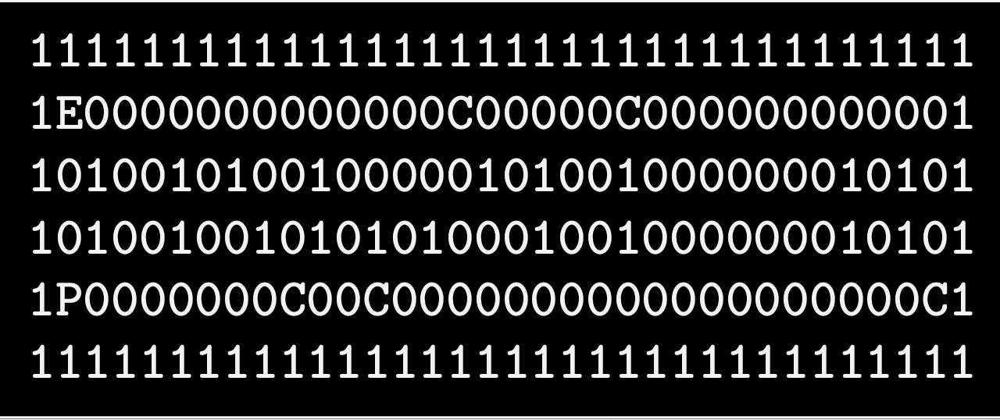

### 
<b>Hi👋, It's So_Long project :</b>

- This project is a very small 2D game.
Its purpose is to make you work with textures, sprites,
and some other very basic gameplay elements.
- so long will help you improve your skills in the following areas: window management,
event handling, colors, textures, and so forth.

 

 

  <h2>minimap 1</h2>
  <h3>map0.ber</h3>
  
  <h3>result</h3>
  

 

  <h2>minimap 2</h2>
  <h3>map01.ber</h3>
  
  <h3>result</h3>
  

